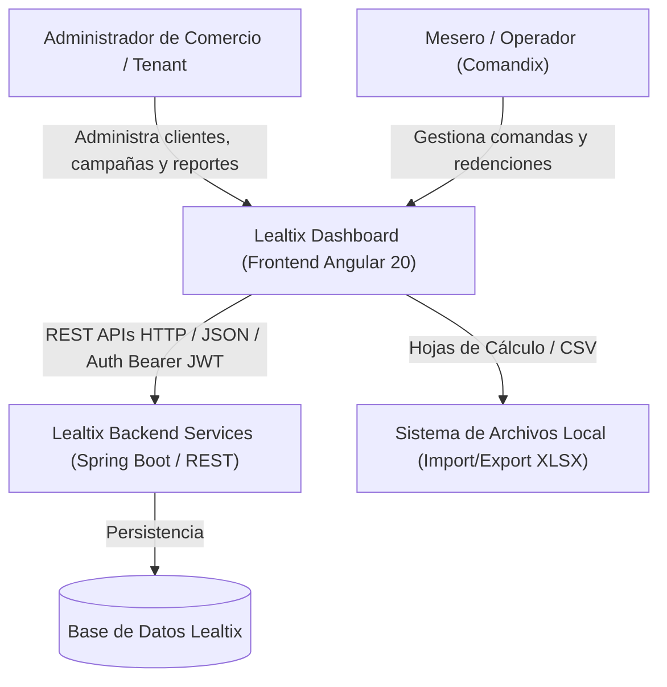
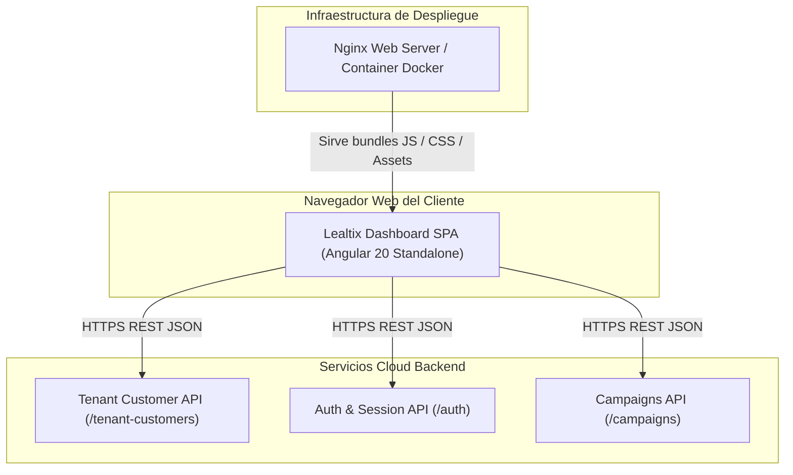

# SDD - Capítulo 2: Modelo C4 - Diagramas de Contexto (L1) y Contenedores (L2)

## 2.1 C4 Nivel 1: Diagrama de Contexto del Sistema

El diagrama de contexto ubica a **Lealtix Dashboard** en relación con sus usuarios finales y sistemas externos (Backend APIs, Servicios de Correo/Notificaciones, Pasarelas de Pago).

---

## 2.2 C4 Nivel 2: Diagrama de Contenedores

Este diagrama detalla cómo la aplicación Single Page Application (SPA) interactúa con el servidor de contenido estático y las dependencias de ejecución.

### Protocolos e Interfaces de Contenedor
- **SPA $\rightarrow$ Nginx**: HTTP/2 en puerto 80/443 (Gzip/Brotli compresión de assets).
- **SPA $\rightarrow$ REST APIs**: HTTP/HTTPS con payloads JSON y encabezado `Authorization: Bearer <JWT>`.
