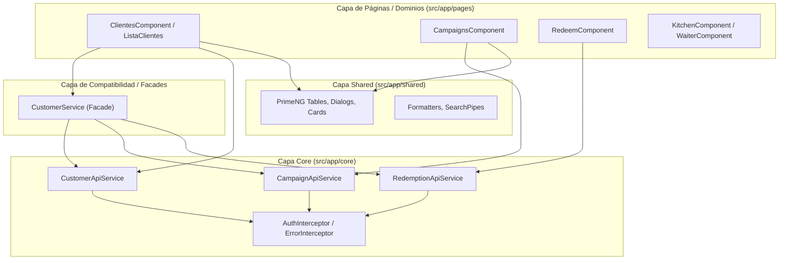

# SDD - Capítulo 3: C4 Nivel 3 - Arquitectura de Componentes Internos

## 3.1 Estructura Interna del Frontend (Angular 20 Standalone)

El contenedor SPA se descompone en tres subsistemas modulares con límites bien definidos:

---

## 3.2 Responsabilidades por Subsistema

1. **`core/services`**: Encapsula todas las llamadas HTTP puras, manejo de parámetros (`HttpParams`), errores HTTP y deserialización de DTOs (`GenericResponse<T>`).
2. **`pages/service/customer.service.ts` (Facade)**: Garantiza la compatibilidad hacia atrás para componentes heredados delegando en los servicios de `core`.
3. **`pages/<domain>`**: Vistas y páginas de negocio responsables del flujo de la interfaz de usuario.
4. **`shared`**: UI kit puro sin estado de negocio.
