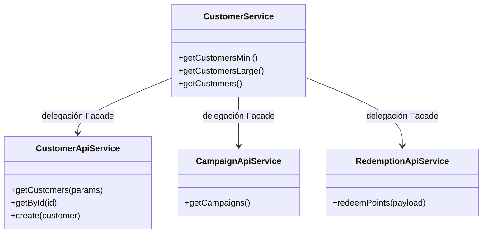

# SDD - Capítulo 4: C4 Nivel 4 - Diseño de Código, Patrones y Principios SOLID

## 4.1 Aplicación Estricta de Principios SOLID

### 1. Single Responsibility Principle (SRP)
- **Problema previo**: `CustomerService` contenía más de 9,000 líneas combinando mock de 500 clientes con métodos de infraestructura HTTP.
- **Solución**:
  - `CustomerApiService`: Responsable exclusivo de llamadas HTTP a `/tenant-customers`.
  - `CampaignApiService`: Responsable exclusivo de campañas de incentivos.
  - `RedemptionApiService`: Responsable exclusivo de redención de premios.
  - `RewardApiService`: Responsable exclusivo del catálogo de recompensas.

### 2. Open/Closed Principle (OCP)
- Los servicios de API se extienden mediante composición y operadores de RxJS sin modificar el código fuente interno.

### 3. Liskov Substitution Principle (LSP)
- Implementación de contratos de interfaz estrictos (`Cliente`, `ClienteSearchParams`, `GenericResponse<T>`) garantizando la sustituibilidad de mock a API real.

### 4. Interface Segregation Principle (ISP)
- División de modelos gigantes en interfaces de dominio delgadas e inmunes a campos irrelevantes.

### 5. Dependency Inversion Principle (DIP)
- Inyección de dependencias de Angular (`@Injectable()`) e inyección basada en `HttpClient` e interfaces en lugar de instanciación manual `new Service()`.

---

## 4.2 Patrones de Diseño Utilizados

- **Patrón Facade**: `CustomerService` actúa como fachada transparente reduciendo la complejidad del sistema reorganizado para los componentes existentes.
- **Patrón Adapter**: Mapeo de `GenericResponse<T>` del backend a estructuras listas para renderizado en componentes PrimeNG.
