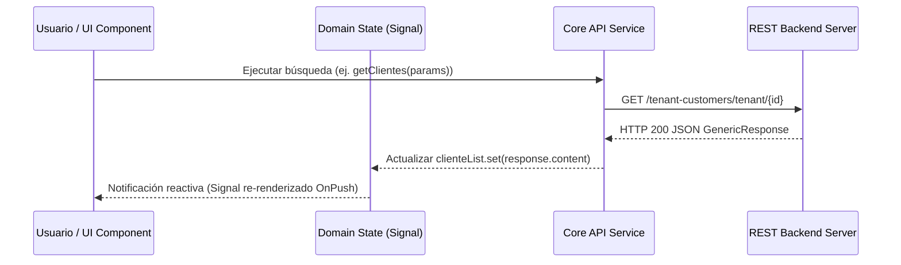

# SDD - Capítulo 5: Gestión de Estado y Flujos de Datos

## 5.1 Arquitectura de Estado con Angular Signals

El estado reactivo del sistema se gestiona con **Signals** en Angular 20 para sincronización fina sin sobrecarga de NgRx.

---

## 5.2 Estrategia de Manejo de Errores y Resiliencia

1. **HttpInterceptors**: Intercepción centralizada de errores HTTP (401 Unauthorized, 403 Forbidden, 500 Internal Server Error) notificando al usuario mediante `ToastService` de PrimeNG.
2. **RxJS `catchError`**: Transformación de fallos de red en estados de error legibles en los Signals (`errorState.set('Mensaje de error')`).
3. **Optimistic Updates**: En operaciones rápidas (ej. cambiar estado de mesa o marcar comanda en Comandix), la interfaz actualiza el Signal de inmediato y revierte solo en caso de falla HTTP.
