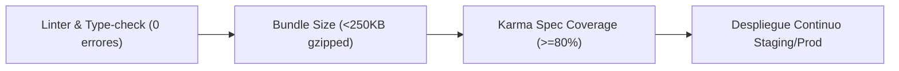

# SDD - Capítulo 7: Métricas Cuantitativas y Optimización Continua (CMMI L4 & L5)

## 7.1 Indicadores de Gestión Cuantitativa (CMMI Nivel 4)

El proyecto monitorea cuantitativamente la calidad técnica del código para predecir y evitar defectos antes del despliegue en producción.

### Tabla de Umbrales Cuantitativos

| Métrica | Definición | Umbral Objetivo (KPI) | Frecuencia de Control | Herramienta |
|---|---|---|---|---|
| **Coverage Code** | Porcentaje de líneas probadas en `core/services/` y `Facades` | $\ge 80\%$ | En cada PR / Commit | Karma + Coverage Reporter |
| **Complejidad Ciclomática** | Número de caminos independientes $v(G)$ por función | $v(G) \le 10$ | Durante desarrollo | ESLint complexity rule |
| **Initial Bundle Size** | Tamaño de paquete JavaScript inicial entregado al navegador | $\le 250\text{ KB}$ gzipped | En `ng build` CI/CD | Angular Budget CLI |
| **LCP (Largest Contentful Paint)** | Tiempo de carga del elemento principal visual en pantalla | $\le 1.8\text{ s}$ | Auditoría semanal | Lighthouse / Chrome DevTools |
| **Defect Density** | Número de errores críticos por cada 1,000 líneas de código | $< 0.5$ errores/kLOC | Por Sprint | Tracker de incidencias |

---

## 7.2 Proceso de Optimización Continua (CMMI Nivel 5)

1. **Prevención Automatizada de Defectos**: Uso de hooks de Git y reglas estrictas de linter para bloquear código desalineado con SOLID antes de fusionar la rama.
2. **Refactorización sin Riesgos (Ref-Safe)**: Todo cambio estructural mayor se realiza mediante el patrón **Facade/Adapter**, permitiendo desplegar la nueva arquitectura mientras se mantiene la compatibilidad con el código antiguo.
3. **Análisis de Causas Raíz (RCA)**: Ante cualquier bug en producción, se actualiza la matriz de trazabilidad y se añade una prueba unitaria de regresión obligatoria.
